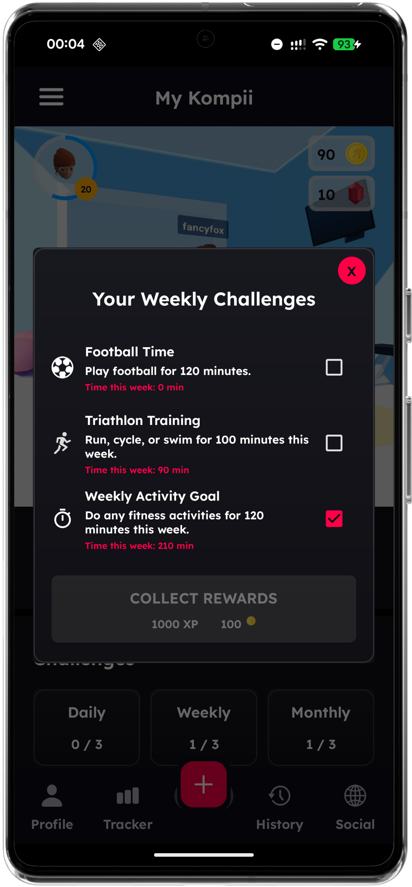
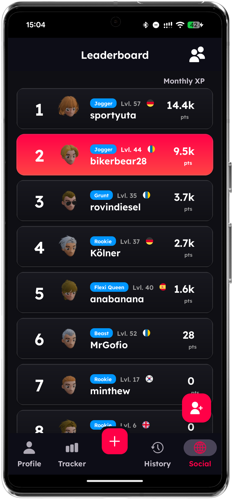

## Hi there 👋

I'm Tim, a **mobile app developer** passionate about creating engaging and impactful applications.  
Currently, I'm focusing on building apps that combine **fitness, fun, and social features**.

### 🚀 Featured Project
**Kompii** – a social fitness app that makes working out more fun and competitive.  
Available now on both platforms:

- [🤖 Get it on Google Play](https://play.google.com/store/apps/details?id=com.rtkolabs.levelup&hl=en_GB)  
- [📱 Download on the App Store](https://apps.apple.com/us/app/kompii/id6475413819)  

You can also learn more at my promotional website: [🌐 rtkolabs.com](https://rtkolabs.com)

---

💡 On this GitHub, I mostly share **snippets, concepts, and demos** of my work rather than full codebases.  
If you'd like to know more about my projects or code, feel free to reach out!

### 🎨 3D Graphics with Google Filament
In Kompii, I use **Google Filament** to render smooth and performant 3D avatars.  
This allows users to customize their avatar in real-time with:

- Multiple hairstyles, clothes, and accessories  
- Dynamic lighting and shadows  
- High-quality textures optimized for mobile  

Here's a preview of the avatar system in action:  


---

### Avatar3D Snippets

Here are a few **highlighted code snippets** from Kompii's avatar system:

#### 1️⃣ Dynamic Hair Selection
Show or hide specific hairstyles in the avatar:

```kotlin
fun showOnlyHairstyleByName(targetName: String, modelViewer: ModelViewer) {
    val asset = modelViewer.asset ?: return
    val scene = modelViewer.scene

    // Show all hair entities
    for (entity in asset.entities) {
        val entityName = asset.getName(entity).lowercase()
        if (entityName.contains("hair")) scene.addEntity(entity)
    }

    // Hide hair not matching target
    for (entity in asset.entities) {
        val entityName = asset.getName(entity).lowercase()
        if (entityName.contains("hair") && !entityName.startsWith(targetName.lowercase())) {
            scene.removeEntity(entity)
        }
    }
}
```

#### 2️⃣ Material Coloring
This function applies a color overlay to an avatar's material at runtime. It blends a base hex color with an existing texture, allowing dynamic customization of avatar appearances such as hair, clothes, or accessories.

```kotlin
private fun applyColorToMaterial(
    material: MaterialInstance,
    hexColor: String,
    textureResourceId: Int,
    blendPercentage: Float,
    overlayMode: PorterDuff.Mode
) {
    val baseColorInt = Color.parseColor(hexColor)
    val adjustedAlpha = (Color.alpha(baseColorInt) * blendPercentage).toInt()
    val blendedColor = baseColorInt and 0x00FFFFFF or (adjustedAlpha shl 24)

    val originalBitmap = BitmapFactory.decodeResource(context.resources, textureResourceId)
    val resizedBitmap = resizeBitmap(originalBitmap, 256, 256)

    val modifiedBitmap = resizedBitmap.copy(Bitmap.Config.ARGB_8888, true)
    Canvas(modifiedBitmap).drawBitmap(modifiedBitmap, 0f, 0f, Paint().apply {
        colorFilter = PorterDuffColorFilter(blendedColor, overlayMode)
    })

    val byteBuffer = ByteBuffer.allocateDirect(modifiedBitmap.width * modifiedBitmap.height * 4)
    modifiedBitmap.copyPixelsToBuffer(byteBuffer)
    byteBuffer.rewind()

    val texture = Texture.Builder()
        .width(modifiedBitmap.width)
        .height(modifiedBitmap.height)
        .levels(1)
        .sampler(Texture.Sampler.SAMPLER_2D)
        .format(Texture.InternalFormat.SRGB8_A8)
        .build(modelViewer.engine)

    texture.setImage(modelViewer.engine, 0, Texture.PixelBufferDescriptor(
        byteBuffer, Texture.Format.RGBA, Texture.Type.UBYTE, 1
    ))
    material.setParameter("baseColorMap", texture, TextureSampler())
}
```

#### 3️⃣ Generating Challenges



Generates a pool of daily fitness challenges, scales targets by user difficulty, and selects three unique challenges randomly each day:

```kotlin
val dailychallengePool = mutableListOf<Challenge>()
val dailyTarget = (20 * (1 + profiledifficultyD!! / 10.0)).toInt()

dailychallengePool.add(
    Challenge(
        title = "Today's Activity Goal",
        text = "Complete $dailyTarget min of fitness today.",
        progress = "Time today: $dailyallFitnessCounter min",
        isCompleted = { dailyallFitnessCounter >= dailyTarget }
    )
)

if (footballEnable) {
    dailychallengePool.add(
        Challenge(
            title = "Football Time",
            text = "Play football for $dailyFootballendval minutes.",
            imageName = "soccerball_inverse",  // your drawable image name here
            progress = "Time today: $profiledailyFootballCounter min",
            isCompleted = { profiledailyFootballCounter!! >= dailyFootballendval }
        )
    )
}

val dailyselectedIndices = mutableSetOf(dailyRNG1!! % dailychallengePool.size,
                                        dailyRNG2!! % dailychallengePool.size,
                                        dailyRNG3!! % dailychallengePool.size)
// Ensure 3 unique indices
var add = 1
while (dailyselectedIndices.size < 3)
    dailyselectedIndices.add((dailyselectedIndices.elementAt(0) + add++) % dailychallengePool.size)
```

#### 3️⃣ Loading Leaderboard from Query


```

fun loadLeaderboard() {
    val sharedPref = activity?.getPreferences(Context.MODE_PRIVATE) ?: return
    leaderboardRV.layoutManager = LinearLayoutManager(context)

    val friendsQuery = mFriendsDatabase.child(user.uid)
        .orderByChild("/status").equalTo("1")

    friendsData = mutableListOf()

    friendsQuery.addListenerForSingleValueEvent(object : ValueEventListener {
        override fun onDataChange(snapshot: DataSnapshot) {
            val remaining = snapshot.childrenCount.toInt()
            if (remaining == 0) return

            snapshot.children.forEach { child ->
                val friendId = child.key ?: return@forEach
                FirebaseDatabase.getInstance().getReference("Users").child(friendId)
                    .addListenerForSingleValueEvent(object : ValueEventListener {
                        override fun onDataChange(profileSnap: DataSnapshot) {
                            profileSnap.getValue<UserData>()?.let { profile ->
                                friendsData.add(Friend.fromUserData(profile))
                            }

                            // When all friends are loaded → sort + update UI
                            if (friendsData.size == remaining) {
                                val sortedFriends = friendsData.sortedByDescending { it.fitness }
                                leaderboardRV.adapter = LeaderboardAdapter(sortedFriends)

                                sharedPref.edit()
                                    .putString("${user.uid}_sortedList", Gson().toJson(sortedFriends))
                                    .apply()
                            }
                        }
                        override fun onCancelled(error: DatabaseError) {}
                    })
            }
        }
        override fun onCancelled(error: DatabaseError) {}
    })
}


